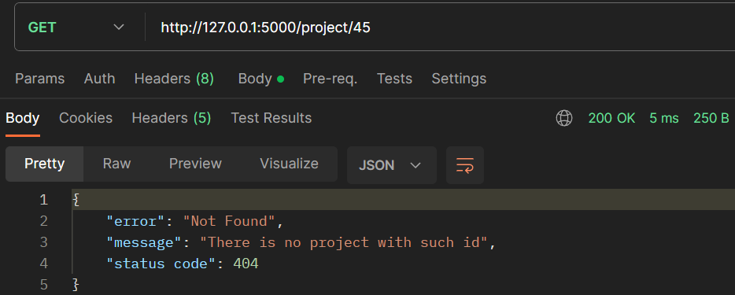
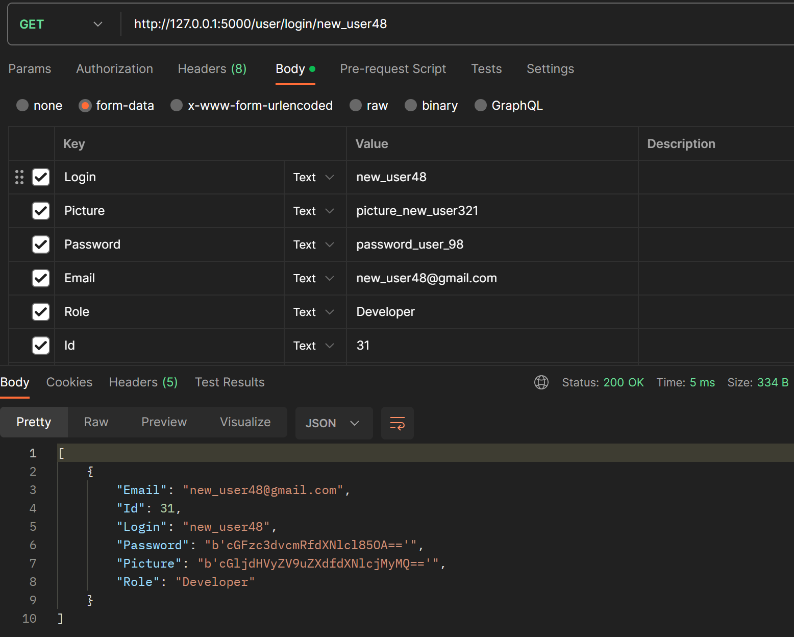

# Тестування працездатності системи

*В цьому розділі необхідно вказати засоби тестування, навести вихідні коди тестів та результати тестування.*

## GET /projects
 

## GET /project/\<id\>
 

## GET /project/\<id\> Error report
 

## GET /project/\<id\> Error report
 

## GET /users
 

## GET /user/\<id\>
 

## GET /user/login/\<Login\>
 

## GET /user/\<id\>	  Error report
 

## GET /user/\<id\>	  Error report
 

## GET /user/login/\<Login\>	Error report
 

## POST /project/add
 
 

## POST /user/add
 
 

## POST /user/add	Error report
 

## POST /user/add	Error report
 

## POST /user/add	Error report
 

## PUT /project/update
 
 

## PUT /project/update   Error report
 

## PUT /project/update   Error report
 

## PUT /project/update   Error report
 

## PUT /user/update
 
 

## PUT /user/update   Error report
 

## PUT /user/update   Error report
 

## PUT /user/update   Error report
 

## PUT /user/update   Error report
 

## DELETE /project/delete/\<id\>
 
 

## DELETE /project/delete/\<id\>   Error report
 

## DELETE /project/delete/\<id\>   Error report
 

## DELETE /user/delete/\<id\>
 
 

## DELETE /user/delete/\<id\>   Error report
 

## DELETE /user/delete/\<id\>   Error report
 

